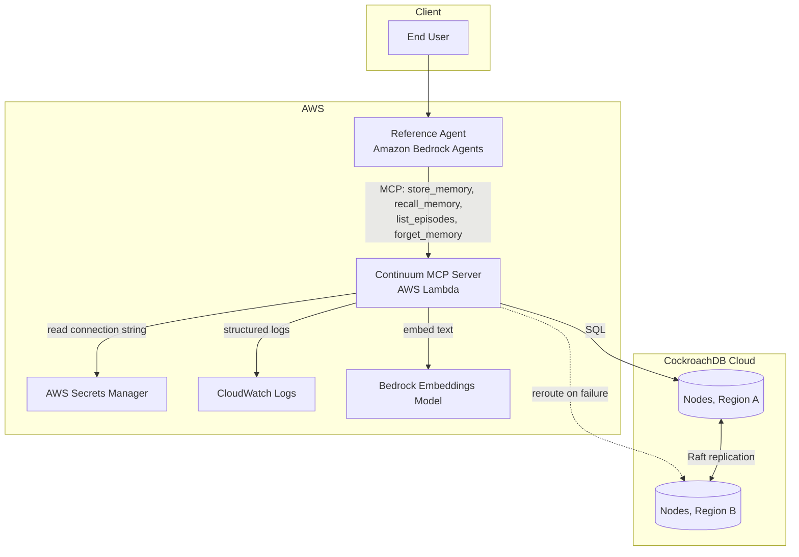

# Continuum: Architecture

This expands on [SRS.md §5–§7](SRS.md#5-architecture) with implementation-level detail: how the components fit together, what happens on a request, and why each trade-off went the way it did. Requirements and acceptance criteria live in the SRS itself; read that first if you haven't.

## 1. Component view

| Component | Responsibility | Failure behavior |
|---|---|---|
| Reference Agent (Bedrock Agents) | Reasoning loop; decides when to call which memory tool | Holds no memory state itself, so a crash mid-session loses nothing |
| Continuum MCP Server (Lambda) | Implements the 4 MCP tools; validates input against the schemas in [docs/api/mcp-tools.md](docs/api/mcp-tools.md); issues SQL | Also stateless. A cold start or a burst of concurrent invocations can't lose data, because none of it lives here |
| Bedrock Embeddings Model | Converts semantic-memory text to a fixed-dimension vector | If it's unreachable, `store_memory`/`recall_memory` on the semantic tier fail closed with an error rather than a partial write. Working and episodic tiers don't touch this model, so they're unaffected |
| CockroachDB Cloud cluster | Durable storage, vector search, Raft-replicated consistency | Built to survive losing one full region; §4 and `RUNBOOK.md`'s failover drill cover how that gets proven |

## 2. Request flow

### Write path (`store_memory`)

1. Agent calls `store_memory` with `tier`, `actor_id`, `content`, and tier-specific fields.
2. Lambda validates the payload against the JSON Schema in [docs/api/mcp-tools.md](docs/api/mcp-tools.md). Malformed input gets rejected before any SQL is constructed.
3. For `tier: semantic`, Lambda calls the Bedrock embeddings model to produce the vector; for `working`/`episodic`, this step is skipped.
4. Lambda issues a parameterized `INSERT` against the target table (§3, Data Model) using a connection pooled to the CockroachDB cluster's nearest-region gateway.
5. CockroachDB doesn't acknowledge the write to the client until it's durably replicated per Raft consensus. This is CockroachDB's default `SERIALIZABLE` behavior, not custom code, and it's what NFR-CONS-01 in the SRS depends on.
6. Lambda returns `{id, tier, created_at, source_tool}` to the agent.

### Read path (`recall_memory`)

1. Agent calls `recall_memory` with `actor_id`, `query`, optional `tier_filter`.
2. Lambda embeds `query` via Bedrock (only needed for the semantic-tier branch of the search).
3. Lambda issues a query pre-filtered by `actor_id`, so the ANN search space excludes other actors (see the Data Model's index-strategy note), then ranks by a blend of vector similarity and recency per `recency_weight`.
4. If the query includes `tier_filter: episodic` or `all`, `list_episodes`'s underlying scan runs alongside it and the results get merged.
5. Lambda returns ranked results with provenance fields attached (`actor_id`, `created_at`, `source_tool`). Never bare content on its own.

## 3. Data model

Full `CREATE TABLE` statements are in [SRS.md §6](SRS.md#6-data-model). Summary:

| Table | Key | Notable index |
|---|---|---|
| `working_memory` | `(session_id, key)` | Row-level TTL (`expires_at`), no cron job needed |
| `episodic_memory` | `episode_id` | `(actor_id, created_at DESC)`, serves `list_episodes`'s recency scan |
| `semantic_memory` | `memory_id` | Distributed Vector Indexing on `embedding` (`vector_cosine_ops`, matching `recall_memory`'s `<=>` operator); secondary `actor_id` index bounds the ANN search space per query |

**Prerequisite the schema depends on.** None of this table locality reasoning means anything until the database itself is configured multi-region: `ALTER DATABASE ... ADD REGION` for each region plus `ALTER DATABASE ... SURVIVE REGION FAILURE`, per [SRS.md §6](SRS.md#6-data-model). A cluster with 3 regions provisioned at the infrastructure level still creates single-region databases by default; this step is what actually gets ranges replicated across regions (replication factor 3 to 5) instead of just sitting in whichever region happened to be primary. Missing it doesn't error, which is exactly how it went unnoticed until the Day 2 gate check caught a failover drill "passing" in 0.0s against a database that was never actually multi-region (`.archive/LOG.md`, 2026-08-01).

**Region placement.** CockroachDB Cloud's multi-region table locality (`REGIONAL BY ROW` vs. `GLOBAL`) gets chosen per table, based on how each one is actually accessed:
- `episodic_memory` and `semantic_memory` get written and read from wherever the session happens to be routed, so `REGIONAL BY ROW` keeps the leaseholder near the writer and latency low for the common case.
- `working_memory` is short-lived and session-local, so its region locality just follows the session's origin region.

The actual locality settings get finalized against the real cluster during the Week 1 spike (SRS §14). What's written here is the reasoning, not a number guessed at before there's a cluster to test it on.

## 4. Multi-region failover design

This is the system's core differentiating property (SRS FR-3), and it's what `RUNBOOK.md`'s drill exercises directly.

- The cluster runs across two or more CockroachDB Cloud regions from day one, not bolted on later. See `DEPLOYMENT.md`.
- Every write commits via Raft consensus across replicas in multiple regions before it's acknowledged. Losing one region can't lose an acknowledged write, because that's how CockroachDB's replication protocol works, not because Continuum adds anything on top.
- The Lambda connects to the cluster's SQL gateway rather than a specific node, so a region failure is invisible to the application code. There's no manual failover logic in Continuum itself; correctness comes from CockroachDB's own consensus, not a bespoke retry layer that would need its own testing to trust.
- What Continuum does own is the demo choreography that proves this live (`RUNBOOK.md`'s failover drill) and the NFR targets in SRS §4 that define what "acceptable" recovery actually means.

## 5. Design trade-offs

| Decision | Alternative considered | Why this way | Detail |
|---|---|---|---|
| Three separate tables instead of one table with a `tier` column | Single `memories` table, tier as metadata | Each tier has a genuinely different access pattern (TTL point-lookup vs. recency scan vs. ANN search). Collapsing them into one table would mean every query pays for indexes it doesn't need | [ADR-001](docs/adr/0001-tiered-memory-model.md) |
| CockroachDB over plain Postgres+pgvector | Reuse `mcp-server-pgvector` as-is | Multi-region survivability (FR-3) is the hackathon's actual differentiator and isn't achievable with single-region Postgres without building custom replication | [ADR-002](docs/adr/0002-cockroachdb-over-postgres.md) |
| Lambda over long-running ECS/EKS service | Containerized MCP server | Stateless request/response tool calls fit Lambda's model; no persistent connection pool to manage across deploys; scales to zero between demo sessions | [ADR-003](docs/adr/0003-lambda-over-ecs.md) |
| Lightweight provenance instead of hash-chained audit log | Full cryptographic tamper-evident chain | Answers "where did this come from" (Production Readiness criterion) without the scope of a cryptographic audit system. Explicitly cut, SRS §13 | [ADR-004](docs/adr/0004-lightweight-provenance.md) |

## 6. What this architecture does not do

Worth repeating from SRS §13, because these cuts shaped design decisions directly, not just the feature list:

- No per-tenant RBAC. `actor_id` scoping is the only isolation boundary there is (see SRS §8).
- No learned memory-decay. `working_memory`'s TTL is a fixed constant someone set, not something a model decided.
- No application-level conflict resolution for cross-region active-active writes, beyond whatever CockroachDB already handles natively.
