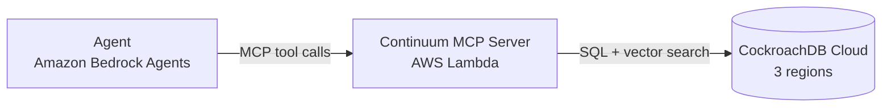

# Continuum

[](LICENSE)
[](https://github.com/mittalpk/Continuum/actions/workflows/ci.yml)

Continuum gives an [MCP](https://modelcontextprotocol.io/)-compatible agent persistent memory: working, episodic, and semantic, backed by [CockroachDB](https://www.cockroachlabs.com/)'s distributed SQL and vector indexing. The point isn't just storing memory. It's proving the configuration behind it actually survives losing a whole cloud region, not just claiming it would.

Built for the [CockroachDB × AWS "Build with Agentic Memory" Hackathon](https://cockroachdb-ai.devpost.com/).

## Why

Most agent memory today is either nothing (every session starts blank) or a single vector store with everything dumped in as "semantic." That's not how memory actually works. What happened *this turn* needs different handling than what happened *last week*, which needs different handling than a durable fact about a user. And none of it matters if a region outage wipes it out the moment someone actually relies on it.

Continuum splits memory into three tiers with genuinely different access patterns, exposes them as MCP tools any agent can call, and runs on a CockroachDB cluster spread across 3 regions with REGION survival goal configured, the minimum CockroachDB requires to actually survive losing one. See [SRS.md FR-3](SRS.md#fr-3-multi-region-distribution-proven-by-configuration) for why that's demonstrated through configuration and a written explanation rather than a live region kill in the demo video.

Requirements and design rationale: [SRS.md](SRS.md).

## Architecture



Three memory tiers, one cluster, four MCP tools: `store_memory`, `recall_memory`, `list_episodes`, `forget_memory`. Details in [ARCHITECTURE.md](ARCHITECTURE.md).

## Quickstart

```bash
git clone https://github.com/mittalpk/Continuum.git
cd Continuum
uv sync

# Point at a running CockroachDB cluster (see DEPLOYMENT.md for a real multi-region
# setup, or a single-node local instance for development, per CONTRIBUTING.md)
export DATABASE_URL="postgresql://root@localhost:26257/continuum?sslmode=disable"
export MCP_CONTINUUM_EMBEDDING_MODEL="amazon.titan-embed-text-v2:0"

cockroach sql --url "$DATABASE_URL" -f infra/sql/schema.sql   # applies SRS.md §6's schema
uv run uvicorn continuum.server:app --host 127.0.0.1 --port 8000
```

Point any MCP client (Claude Desktop, the MCP Inspector, or the Bedrock reference agent once deployed) at the running server. [docs/api/mcp-tools.md](docs/api/mcp-tools.md) has the full tool reference with examples. `src/continuum/agent.py` is a local reference-agent harness exercising the same tools end to end without needing a real MCP client; see `tests/integration/test_agent.py` for it in action.

## Documentation

| Document | What it covers |
|---|---|
| [SRS.md](SRS.md) | Requirements, acceptance criteria, non-functional targets |
| [ARCHITECTURE.md](ARCHITECTURE.md) | Component design, data model, request flow, trade-offs |
| [docs/adr/](docs/adr/) | Why the load-bearing decisions were made |
| [docs/api/mcp-tools.md](docs/api/mcp-tools.md) | MCP tool reference with examples |
| [docs/DEMO_SCRIPT.md](docs/DEMO_SCRIPT.md) | The submission video's shot list |
| [docs/SUBMISSION_NOTES.md](docs/SUBMISSION_NOTES.md) | Draft answers for the hackathon submission form |
| [DEPLOYMENT.md](DEPLOYMENT.md) | Provisioning the cluster, Lambda, and reference agent |
| [RUNBOOK.md](RUNBOOK.md) | Operating a deployed system: multi-region checks, rollback, incident response |
| [SECURITY.md](SECURITY.md) | Threat model, secrets handling, disclosure policy |
| [TESTING.md](TESTING.md) | Test strategy and how to run the suite |
| [CONTRIBUTING.md](CONTRIBUTING.md) | Dev setup, PR process |
| [CODE_OF_CONDUCT.md](CODE_OF_CONDUCT.md) | Community standards |
| [CHANGELOG.md](CHANGELOG.md) | Version history |

## Status

All four MCP tools (`store_memory`, `recall_memory`, `list_episodes`, `forget_memory`) are implemented and tested against a live multi-region CockroachDB cluster, along with a local reference-agent harness proving FR-5's cross-session recall and NFR-PORT-01's generic-MCP-client requirement with a real client, not an in-process shortcut. Real Terraform exists for the Lambda deployment; an actual `terraform apply` and Bedrock Agents registration are pending AWS account access, tracked honestly rather than assumed done. See [SRS.md §13](SRS.md#13-explicit-scope-cuts) for what's deliberately left out of this version, and [SRS.md §14](SRS.md#14-timeline) for the build timeline.

## License

[MIT](LICENSE)
