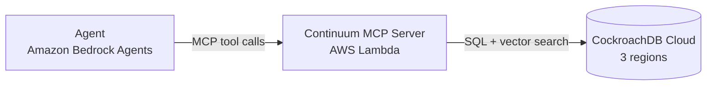

# Continuum

[](LICENSE)
[](#)

Continuum gives an [MCP](https://modelcontextprotocol.io/)-compatible agent persistent memory: working, episodic, and semantic, backed by [CockroachDB](https://www.cockroachlabs.com/)'s distributed SQL and vector indexing. The point isn't just storing memory. It's proving that memory survives losing a whole cloud region, on camera, not as a slide claiming it would.

Built for the [CockroachDB × AWS "Build with Agentic Memory" Hackathon](https://cockroachdb-ai.devpost.com/).

## Why

Most agent memory today is either nothing (every session starts blank) or a single vector store with everything dumped in as "semantic." That's not how memory actually works. What happened *this turn* needs different handling than what happened *last week*, which needs different handling than a durable fact about a user. And none of it matters if a region outage wipes it out the moment someone actually relies on it.

Continuum splits memory into three tiers with genuinely different access patterns, exposes them as MCP tools any agent can call, and runs on a CockroachDB cluster spread across 3 regions (the minimum CockroachDB requires to actually survive losing one). The demo kills a region mid-conversation and shows the agent still remembering.

Requirements and design rationale: [SRS.md](SRS.md).

## Architecture



Three memory tiers, one cluster, four MCP tools: `store_memory`, `recall_memory`, `list_episodes`, `forget_memory`. Details in [ARCHITECTURE.md](ARCHITECTURE.md).

## Quickstart

> Pre-implementation as of this writing: the commands below are the target interface from [SRS.md §7](SRS.md#7-api--mcp-tool-contracts), not something you can `git clone` and run yet. No `continuum` package, Terraform, or CI is committed to the repo. Build progress is tracked internally against [SRS.md §14](SRS.md#14-timeline).

```bash
git clone https://github.com/<org>/continuum.git
cd continuum
uv sync

# Point at a running CockroachDB cluster (see DEPLOYMENT.md for a real multi-region setup,
# or use a single-node local instance for development)
export DATABASE_URL="postgresql://root@localhost:26257/continuum?sslmode=disable"
export MCP_CONTINUUM_EMBEDDING_MODEL="amazon.titan-embed-text-v2:0"

uv run python -m continuum.migrate   # applies the schema in ARCHITECTURE.md's Data Model section
uv run python -m continuum.server    # starts the MCP server
```

Point any MCP client (Claude Desktop, MCP Inspector, or the Bedrock reference agent) at the running server. [docs/api/mcp-tools.md](docs/api/mcp-tools.md) has the full tool reference with examples.

## Documentation

| Document | What it covers |
|---|---|
| [SRS.md](SRS.md) | Requirements, acceptance criteria, non-functional targets |
| [ARCHITECTURE.md](ARCHITECTURE.md) | Component design, data model, request flow, trade-offs |
| [docs/adr/](docs/adr/) | Why the load-bearing decisions were made |
| [docs/api/mcp-tools.md](docs/api/mcp-tools.md) | MCP tool reference with examples |
| [docs/DEMO_SCRIPT.md](docs/DEMO_SCRIPT.md) | The submission video's shot list |
| [docs/SUBMISSION_NOTES.md](docs/SUBMISSION_NOTES.md) | Draft answers for the hackathon submission form |
| [DEPLOYMENT.md](DEPLOYMENT.md) | Provisioning the cluster, Lambda, and reference agent |
| [RUNBOOK.md](RUNBOOK.md) | Operating a deployed system: failover drill, rollback, incident response |
| [SECURITY.md](SECURITY.md) | Threat model, secrets handling, disclosure policy |
| [TESTING.md](TESTING.md) | Test strategy and how to run the suite |
| [CONTRIBUTING.md](CONTRIBUTING.md) | Dev setup, PR process |
| [CODE_OF_CONDUCT.md](CODE_OF_CONDUCT.md) | Community standards |
| [CHANGELOG.md](CHANGELOG.md) | Version history |

## Status

Pre-implementation. The specs and operational docs are done; the package, infrastructure code, and CI aren't committed yet. See [SRS.md §13](SRS.md#13-explicit-scope-cuts) for what's deliberately left out of this version.

## License

[MIT](LICENSE)
