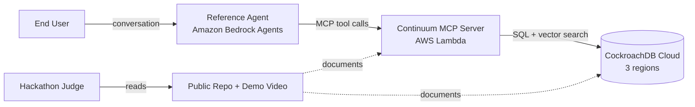
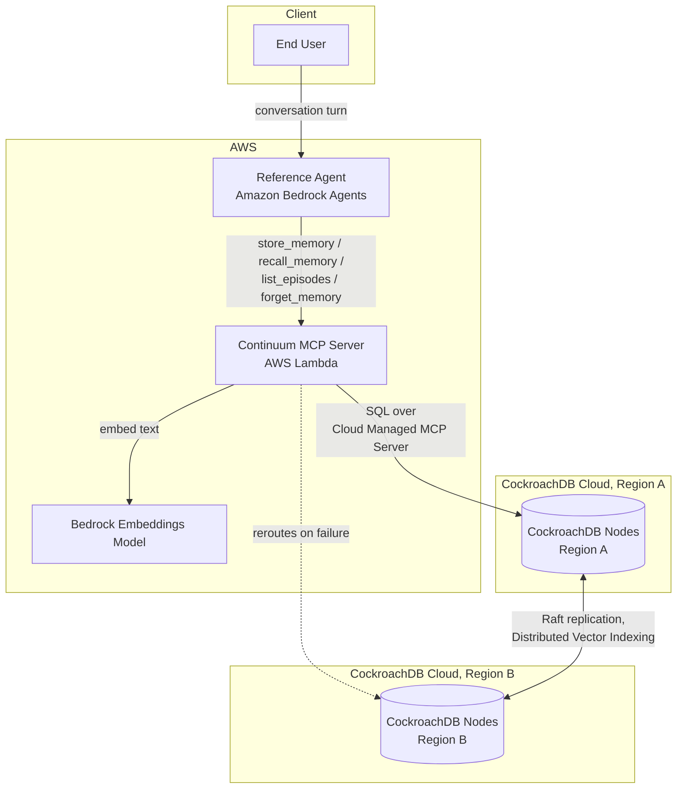
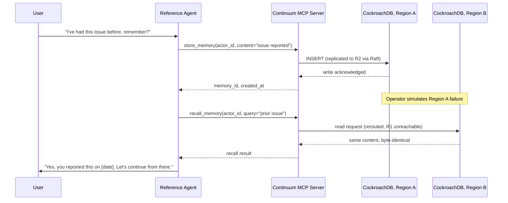

# Continuum
## Software Requirements Specification: Agentic Memory Layer on CockroachDB + AWS

**Document Control**

| Field | Value |
|---|---|
| Version | 2.0 |
| Date | 2026-07-30 |
| Status | Draft, ready for implementation. Open items are tracked in §12 Risk Register |
| Author | Solution Architect |
| Competition | CockroachDB × AWS Hackathon, "Build with Agentic Memory" ([cockroachdb-ai.devpost.com](https://cockroachdb-ai.devpost.com/)) |
| Submission deadline | Aug 18, 2026, 5:00pm EDT |
| License (target) | MIT or Apache 2.0. Submission requirement; final choice tracked in §12, R-06 |
| Repository role | Public. Primary technical artifact for hackathon judges and the open-source community, alongside the code and demo video |

---

## 1. Introduction

### 1.1 Purpose

This document specifies the requirements, architecture, and validation plan for Continuum, an agentic memory layer that gives any MCP-compatible AI agent persistent working, episodic, and semantic memory backed by CockroachDB's distributed SQL and vector indexing.

It's written for three readers: hackathon judges scoring against the five published criteria (§10), engineers evaluating the public repository who need to understand what was built and why without reading the source, and whoever is actually implementing this, who needs a spec to build against.

### 1.2 Scope

In scope: a three-tier memory model, an MCP tool surface for reading and writing that memory, a CockroachDB cluster spread across at least two cloud regions, lightweight provenance tagging on every memory write, and one reference agent (Amazon Bedrock Agents) that depends on Continuum for cross-session recall. The centerpiece deliverable is a live demo of a memory write surviving a simulated regional failure without loss or corruption.

Out of scope, listed in full in §13: hash-chained tamper-evidence, per-tenant RBAC/isolation, learned memory-decay policies, and running more than one reference agent.

### 1.3 References

| Doc | Relevance |
|---|---|
| [mcp-server-pgvector](https://github.com/mittalpk/mcp-server-pgvector) | Architectural sibling. Its MCP tool-safety patterns (identifier-safe SQL, closed filter allowlists, per-query timeouts) get reused directly in §8 and §9 |
| CockroachDB × AWS Hackathon official rules, Devpost | Source of truth for §11 (required integrations), §10 (judging criteria), and submission requirements |

### 1.4 Definitions

See §15 Glossary.

---

## 2. System Overview

### 2.1 Problem statement

Most agent frameworks treat memory as either nothing (every session starts blank) or one undifferentiated vector store where everything is "semantic" and recency stops mattering. Neither matches how memory actually needs to work. A support agent needs to remember this conversation right now, what happened last week, and durable facts about the user, and those three things have different retention, recall, and consistency needs. Then there's the distributed-systems problem underneath all of it: when a region goes down, if memory doesn't survive, the agent's promise to remember you breaks at exactly the moment someone's counting on it.

### 2.2 Solution summary

Continuum splits memory into three explicit tiers, each stored and indexed for its own access pattern, on a single CockroachDB cluster spread across two or more cloud regions. Memory operations are exposed as MCP tools, so any MCP-compatible agent can use Continuum without custom integration work, not just the reference implementation. The reference agent, built on Amazon Bedrock Agents, proves the design against a concrete scenario (§3, FR-6). The demo forces a regional failure mid-scenario, so "the memory survives" is something you watch happen rather than a claim in a slide.

### 2.3 Context diagram



---

## 3. Functional Requirements

Each requirement carries an ID, description, rationale, and acceptance criteria written as verifiable conditions, not one-line bullets, so "done" is checkable by someone other than whoever wrote it.

### FR-1: Tiered Memory Model

**Description.** Continuum stores memory in three distinct tiers, each a separate table/access pattern in CockroachDB, not three logical views over one undifferentiated store.

| Tier | Purpose | Persistence | Access pattern |
|---|---|---|---|
| Working | Current session/turn state | Short TTL (default 30 min idle), row-level TTL expiry | Point lookup by `session_id` |
| Episodic | Durable log of past interactions per agent/user | Indefinite, append-only | Range scan by `(actor_id, created_at)` |
| Semantic | Long-term facts/preferences | Indefinite, mutable (upsert) | Approximate nearest-neighbor over embedding |

**Rationale.** Judging criterion #1, "Agentic Memory Design," is scored ahead of "Technical Implementation." A single vector table with metadata filters would technically satisfy "has memory," but it wouldn't answer what the criterion is actually asking.

**Acceptance criteria.**
- [ ] Three distinct CockroachDB tables exist (`working_memory`, `episodic_memory`, `semantic_memory`), each with the schema in §7.
- [ ] A row written to `working_memory` is unreadable via `recall_memory` after its TTL expires, verified by an automated test that writes, waits past TTL, and asserts a miss.
- [ ] A row written to `episodic_memory` is retrievable via `list_episodes` at any time after write, ordered by recency.
- [ ] A row written to `semantic_memory` is retrievable via `recall_memory`'s similarity search using a semantically related (not identical) query string.

### FR-2: Memory Operations as MCP Tools

**Description.** Four MCP tools (`store_memory`, `recall_memory`, `list_episodes`, `forget_memory`) expose all memory operations, hosted behind CockroachDB's Cloud Managed MCP Server. Nothing about them assumes a particular agent framework.

**Rationale.** This mirrors `mcp-server-pgvector`'s tool surface (§1.3). Reusing that project's identifier-safety and input-validation patterns (§8, §9) means the security design starts from something already known to work, instead of being built from scratch under a hackathon deadline.

**Acceptance criteria.**
- [ ] All four tools are callable from a generic MCP client (Claude Desktop, the MCP Inspector), not only from the Bedrock reference agent, which is what proves they're actually agent-agnostic.
- [ ] Each tool's input/output conforms to the JSON Schema contracts in §8.
- [ ] Malformed input (wrong type, unknown field, oversized payload) is rejected with a structured MCP error, never passed through to raw SQL.
- [ ] `forget_memory` performs a real `DELETE`, verified by a follow-up `recall_memory` returning no result for the deleted key.

### FR-3: Multi-Region Distribution, Proven by Configuration

**Description.** The CockroachDB cluster runs across 3 cloud regions, with the database configured for CockroachDB's REGION survival goal (the minimum required to survive losing a whole region, see §6). Resilience is demonstrated through correct configuration and a clear explanation of the design, not a live, on-camera region kill.

This wasn't the original plan. FR-3 was written assuming a literal simulated failure in the demo video. Confirmed directly with the hackathon organizers (see `.archive/LOG.md`, 2026-08-01): region-disruption testing requires a dedicated (Advanced-tier) cluster, which Standard doesn't provide, since each Basic/Standard cluster runs as a virtual cluster rather than dedicated infrastructure. Their guidance was explicit: judges assess resilience from the database's multi-region configuration and the design decisions behind it, and a written explanation field is available at submission for exactly this. A live region kill is not required or expected.

**Rationale.** Multi-region configuration correctness is still what separates this entry from a plain Postgres+pgvector build. It's just demonstrated by showing the configuration is genuinely in place and explaining why it's sufficient, rather than by a demo segment that turned out to require infrastructure this project's tier can't access.

**Acceptance criteria.**
- [ ] `SHOW SURVIVAL GOAL FROM DATABASE <database>` returns `region`, not `zone` or null, on the deployed cluster.
- [ ] The cluster has 3 regions, matching CockroachDB's documented minimum for REGION survival goal (§6 explains why 2 isn't enough).
- [ ] The demo video and/or submission's written explanation clearly states the configuration, cites CockroachDB's own documentation for what REGION survival goal guarantees under an actual region loss, and is explicit that live failure injection wasn't available on the plan tier used, rather than leaving a judge to assume it was tested live.
- [ ] `scripts/failover_drill.py`'s write/read verification still runs against the live cluster under normal conditions, as evidence the configuration doesn't break anything, even though it can't inject a real regional failure to test recovery from one.

### FR-4: Memory Provenance (Lightweight)

**Description.** Every memory write carries `actor_id`, `created_at`, and `source_tool` (which MCP tool call produced it). It is not a hash-chained, tamper-evident audit log; that's a separate concern, out of scope for this project (see §13).

**Rationale.** This is enough to answer "where did this memory come from" during the demo, which is what the "Production Readiness" criterion is really asking, without taking on a full audit-trail system in a 3.5-week window.

**Acceptance criteria.**
- [ ] Every row in all three tables has non-null `actor_id`, `created_at`, `source_tool`.
- [ ] `recall_memory` and `list_episodes` responses include provenance fields, not just content.
- [ ] Provenance fields are immutable after write (no `UPDATE` path touches them; `forget_memory` deletes the row rather than editing it).

### FR-5: Reference Agent

**Description.** One agent, built on Amazon Bedrock Agents, that genuinely depends on Continuum for cross-session memory. Not a toy that calls the tools once and moves on.

**Rationale.** "Technical Implementation" and "Real-World Impact" both need a real, working consumer of the memory layer. A schema with no client doesn't satisfy either.

**Acceptance criteria.**
- [ ] The agent calls `recall_memory` and/or `list_episodes` at the start of every session before responding to the user.
- [ ] The agent calls `store_memory` when the user states a durable preference or reports an issue.
- [ ] A second session (different `session_id`, same `actor_id`) demonstrably changes the agent's behavior based on the first session's stored memory. This is the actual acceptance test for FR-5, not a nice-to-have for the demo.

### FR-6: Concrete Demo Scenario

**Description.** One scenario, fixed before implementation begins: a customer contacts support twice, days apart, and the second session gets routed to a different region. The agent still remembers the first conversation and doesn't make the user repeat themselves.

**Rationale.** "Real-World Impact" rewards relatability over architectural cleverness. A judge watching a 3-minute video can evaluate "the agent forgot me, and now it doesn't" a lot faster than an abstract list of capabilities.

**Acceptance criteria.**
- [ ] The scenario script exists in writing before any demo recording begins (this is a project-management gate, not just a nice-to-have).
- [ ] The recorded demo follows the script without narration filling gaps the product should show directly.
- [ ] The scenario visibly exercises FR-1 (tiered recall) and FR-2 (tool calls visible or logged on screen). FR-3's resilience story is told through configuration and written explanation (§ FR-3), not a region kill in this scenario.

---

## 4. Non-Functional Requirements

These are targets the project holds itself to, not hackathon rules (those are in §11). They're what a demo-scale system needs to hit before "production-grade" is a credible claim rather than a slogan.

| ID | Category | Requirement | Target | Verification |
|---|---|---|---|---|
| NFR-PERF-01 | Performance | `recall_memory` latency (semantic search, single region, warm cache) | p95 < 300 ms | Load test script, 100 sequential calls, percentile reported |
| NFR-PERF-02 | Performance | `store_memory` latency (single-row write) | p95 < 150 ms | Same harness as above |
| NFR-AVAIL-01 | Availability | Recovery Time Objective for a single-region failure | < 30 s to serve reads/writes from a surviving region | Not empirically testable on this project's plan tier (region-disruption testing requires a dedicated Advanced-tier cluster, confirmed with the hackathon organizers, `.archive/LOG.md` 2026-08-01). Target retained as CockroachDB's own documented expectation for REGION survival goal, cited rather than measured |
| NFR-AVAIL-02 | Availability | Recovery Point Objective for a single-region failure | 0 committed writes lost | Same as above: relies on CockroachDB's documented guarantee for REGION survival goal, not an empirical test this project can run |
| NFR-CONS-01 | Consistency | Acknowledged writes must survive a subsequent regional failure | Serializable isolation (CockroachDB default); no write is ever acknowledged to the MCP client before it is durably replicated per CockroachDB's Raft consensus | Configuration audit: `SHOW SURVIVAL GOAL FROM DATABASE <database>` returns `region`; 3 regions confirmed present. `scripts/failover_drill.py` verifies the write/read path works correctly under normal conditions as a sanity check, but can't inject the actual failure to test recovery from one |
| NFR-SCALE-01 | Scalability | Concurrent demo sessions supported | ≥ 10 concurrent `actor_id`s without cross-talk or lock contention | Scripted concurrent-session test |
| NFR-OBS-01 | Observability | Every MCP tool call is logged with `actor_id`, `source_tool`, latency, and outcome | 100% of calls | Structured JSON logs to CloudWatch (Lambda's default sink) |
| NFR-SEC-01 | Security | No user-supplied input reaches SQL without identifier validation or parameter binding | 100% of query paths | Code review + regression tests mirroring `mcp-server-pgvector`'s injection-attempt test suite (§1.3) |
| NFR-COST-01 | Cost | Total cluster + Lambda + Bedrock spend during build and demo | Within CockroachDB Cloud's free/trial tier + AWS free-tier limits | Monthly cost dashboard check, tracked as R-01 in §12 |
| NFR-PORT-01 | Portability | MCP tool surface usable by any MCP-compliant client, not only Bedrock Agents | Verified against ≥1 non-Bedrock MCP client | Manual test with MCP Inspector or Claude Desktop |

---

## 5. Architecture



**Component responsibilities.**

| Component | Responsibility | Notes |
|---|---|---|
| Reference Agent (Bedrock Agents) | Reasoning loop; decides when to call which memory tool | The only consumer FR-5 requires. Any MCP client could substitute (NFR-PORT-01) |
| Continuum MCP Server (Lambda) | Implements the 4 MCP tools; validates input; issues SQL against CockroachDB | Stateless. All state lives in CockroachDB, so Lambda cold starts don't lose anything |
| Bedrock Embeddings Model | Converts semantic-memory text to vectors on write and query | One embedding model for the whole system; no per-tenant model routing (out of scope, §13) |
| CockroachDB Cloud cluster (3 regions) | Durable storage, Distributed Vector Indexing for semantic recall, Raft-replicated consistency | The system under test for FR-3's failover demo |

**Stack.** Python (Lambda handlers, MCP tool implementations, directly reusing patterns from `mcp-server-pgvector`); CockroachDB Cloud free/trial tier; Bedrock Agents for the reasoning loop; a Bedrock-hosted embeddings model for the semantic tier.

---

## 6. Data Model

**Prerequisite: the database itself has to be configured multi-region before any of this matters.** Provisioning a cluster across 3 regions only puts nodes in those regions; a database created on it defaults to single-region behavior (zone-level survival goal, no cross-region replica placement) until explicitly told otherwise. Every table below assumes this has already been run once against the target database:

```sql
ALTER DATABASE <database> SET PRIMARY REGION "<primary-region>";
ALTER DATABASE <database> ADD REGION "<region-b>";
ALTER DATABASE <database> ADD REGION "<region-c>";
ALTER DATABASE <database> SURVIVE REGION FAILURE;
```

This is what actually gets CockroachDB to replicate ranges across all 3 regions (raising the replication factor from 3 to 5, per CockroachDB's own multi-region documentation) and is the entire precondition for FR-3's failover demo meaning anything. Skipping it doesn't error or warn; it just leaves the database silently single-region, which is exactly the gap this project shipped with until it was caught during the Day 2 gate check (see `.archive/LOG.md`, 2026-08-01).

```sql
-- Working memory: short-lived session state
CREATE TABLE working_memory (
    session_id   UUID NOT NULL,
    key          STRING NOT NULL,
    value        JSONB NOT NULL,
    actor_id     STRING NOT NULL,
    source_tool  STRING NOT NULL,
    created_at   TIMESTAMPTZ NOT NULL DEFAULT now(),
    expires_at   TIMESTAMPTZ NOT NULL,
    PRIMARY KEY (session_id, key)
) WITH (ttl_expire_after = '30 minutes', ttl_expiration_expression = 'expires_at');

-- Episodic memory: durable interaction log
CREATE TABLE episodic_memory (
    episode_id   UUID NOT NULL DEFAULT gen_random_uuid(),
    actor_id     STRING NOT NULL,
    session_id   UUID NOT NULL,
    turn_index   INT NOT NULL,
    role         STRING NOT NULL,         -- 'user' | 'agent'
    content      STRING NOT NULL,
    outcome      STRING,                  -- e.g. 'resolved' | 'escalated' | NULL
    source_tool  STRING NOT NULL,
    created_at   TIMESTAMPTZ NOT NULL DEFAULT now(),
    PRIMARY KEY (episode_id),
    INDEX idx_episodic_actor_time (actor_id, created_at DESC)
);

-- Semantic memory: long-term facts/preferences, embedding-indexed
CREATE TABLE semantic_memory (
    memory_id    UUID NOT NULL DEFAULT gen_random_uuid(),
    actor_id     STRING NOT NULL,
    content      STRING NOT NULL,
    embedding    VECTOR(1024) NOT NULL,   -- amazon.titan-embed-text-v2:0's default output dimension
    confidence   FLOAT NOT NULL DEFAULT 1.0,
    source_tool  STRING NOT NULL,
    created_at   TIMESTAMPTZ NOT NULL DEFAULT now(),
    updated_at   TIMESTAMPTZ NOT NULL DEFAULT now(),
    PRIMARY KEY (memory_id),
    INDEX idx_semantic_actor (actor_id),
    VECTOR INDEX idx_semantic_embedding (embedding vector_cosine_ops)  -- must match recall_memory's <=> operator
);
```

**Index strategy.**
- `working_memory` uses CockroachDB's row-level TTL feature directly. No application-level cron job deletes expired rows, so a demo interruption can't leave stale state around to explain away.
- `episodic_memory`'s `(actor_id, created_at DESC)` index serves `list_episodes` directly, since that's always a per-actor, recency-ordered scan.
- `semantic_memory`'s Distributed Vector Indexing index handles `recall_memory`'s ANN search. The secondary `actor_id` index lets it pre-filter to one actor before the vector search runs, which bounds the search space per query. Worth having even under single-tenant scope (§13), since it's what keeps costs sane once the table has more than a handful of actors in it.
- The index's operator class (`vector_cosine_ops`) has to match the distance operator `recall_memory` actually queries with (`<=>`, cosine). CockroachDB won't use an index built for one distance metric to satisfy a query ordered by another; get this wrong and every query silently falls back to a full table scan instead of erroring, which only shows up as a latency problem against NFR-PERF-01. Confirmed against a live cluster during the Day 1 spike (`spikes/vector_index_spike.py`).
- Region placement follows CockroachDB Cloud's standard multi-region table locality settings. Whether `episodic_memory`/`semantic_memory` end up `REGIONAL BY ROW` or `GLOBAL` gets decided during the Week 1 spike (§14), once there's a real cluster to measure the latency/consistency trade-off against, not guessed at here.
- REGION survival goal (the prerequisite block above) trades write latency for resilience: writes now need to coordinate across 2 of the 3 regions instead of committing locally. This is a real cost against NFR-PERF-02's target, not a free upgrade, and is worth re-measuring once the schema is live rather than assumed away.

---

## 7. API / MCP Tool Contracts

All four tools validate input against these schemas before touching SQL, following `mcp-server-pgvector`'s pattern of rejecting anything outside a closed allowlist rather than sanitizing free-form input (§1.3, §9).

### `store_memory`

```json
{
  "input": {
    "tier": "working | episodic | semantic",
    "actor_id": "string, required",
    "session_id": "string (UUID), required for working/episodic",
    "content": "string, required",
    "key": "string, required for working tier only",
    "metadata": { "outcome": "string, optional (episodic only)" }
  },
  "output": {
    "id": "string (UUID)",
    "tier": "string",
    "created_at": "ISO-8601 timestamp",
    "source_tool": "store_memory"
  }
}
```

### `recall_memory`

```json
{
  "input": {
    "actor_id": "string, required",
    "query": "string, required, natural-language recall query",
    "tier_filter": "working | episodic | semantic | all (default: semantic + episodic)",
    "top_k": "integer, default 5, max 20",
    "recency_weight": "float 0.0-1.0, default 0.2, blends similarity rank with recency"
  },
  "output": {
    "results": [
      {
        "id": "string (UUID)",
        "tier": "string",
        "content": "string",
        "similarity_score": "float, semantic tier only",
        "actor_id": "string",
        "created_at": "ISO-8601 timestamp",
        "source_tool": "string"
      }
    ]
  }
}
```

### `list_episodes`

```json
{
  "input": {
    "actor_id": "string, required",
    "since": "ISO-8601 timestamp, optional",
    "limit": "integer, default 20, max 100"
  },
  "output": {
    "episodes": [
      {
        "episode_id": "string (UUID)",
        "session_id": "string (UUID)",
        "turn_index": "integer",
        "role": "user | agent",
        "content": "string",
        "outcome": "string | null",
        "created_at": "ISO-8601 timestamp"
      }
    ]
  }
}
```

### `forget_memory`

```json
{
  "input": {
    "actor_id": "string, required",
    "memory_id": "string (UUID), required, identifies the exact row to delete",
    "tier": "working | episodic | semantic, required"
  },
  "output": {
    "deleted": "boolean",
    "memory_id": "string (UUID)"
  }
}
```

`forget_memory` takes an exact `memory_id`, not a query. An agent has to call `recall_memory` or `list_episodes` first to find out what it's deleting. That closes off any path from free-text input straight to a `DELETE`, the same discipline `mcp-server-pgvector` applies to its write-capable tools.

---

## 8. Security & Compliance

- **Injection safety.** Every identifier (table or column) used in a dynamically constructed query is checked against a closed allowlist fixed at deploy time. None of it is ever built from tool-call input, and all values are bound parameters. This is `mcp-server-pgvector`'s verified pattern (§1.3), reused rather than re-derived from scratch under time pressure.
- **Least privilege.** The Lambda's CockroachDB credential has DML rights on the three Continuum tables and nothing else. No cluster-admin, no cross-schema access.
- **Secrets.** The CockroachDB connection string and any Bedrock API credentials live in AWS Secrets Manager, get injected into the Lambda at cold start, and are never logged or returned in tool output.
- **Actor scoping.** Every read tool (`recall_memory`, `list_episodes`) filters by `actor_id` server-side, so an agent can't pass someone else's ID and read their memory. This isn't full multi-tenant RBAC, which is explicitly cut (§13). It's the minimum boundary the demo scenario (FR-6) needs to be honest about whose memory is whose.
- **Data sensitivity.** Memory content can include names, issues, and preferences by design, since that's the point of the demo. It's treated as sensitive by default: nothing gets logged in plaintext outside CloudWatch's access-controlled log group, and `forget_memory` does a real deletion rather than flipping a soft-delete flag, so a user's wish to be forgotten actually holds.
- **Provenance vs. audit trail.** FR-4's provenance tagging answers "who, when, which tool," which is what the demo's production-readiness story needs. It isn't tamper-evident: no hash chain, so an operator with direct database access could edit `source_tool` after the fact. That's a known limitation, written down here rather than left for someone to discover later (§13).
- **Timeouts.** Every SQL statement the MCP server issues runs with a bounded timeout, mirroring `mcp-server-pgvector`'s `MCP_PGVECTOR_COMMAND_TIMEOUT_SECONDS` pattern, so a slow vector query mid-failover can't hang the Lambda invocation indefinitely.

---

## 9. Testing & Validation Strategy

| Test type | Target | Method |
|---|---|---|
| Unit | Tool input/output schema validation (§7) | Reject-path tests for every malformed-input case, mirroring `mcp-server-pgvector`'s dimension-mismatch/injection-attempt regressions |
| Integration | All 4 MCP tools against a real (not mocked) CockroachDB instance | CI job spins up a CockroachDB container per PR, same discipline as `mcp-server-pgvector`'s real-pgvector-container CI |
| TTL correctness | FR-1 working-memory expiry | Write, sleep past TTL, assert `recall_memory` miss |
| Concurrency | NFR-SCALE-01 | Script issuing 10 concurrent actor sessions, asserting no cross-actor leakage in results |
| Multi-region config audit | NFR-CONS-01, FR-3 | `SHOW SURVIVAL GOAL FROM DATABASE <database>` returns `region`; `scripts/failover_drill.py` confirms write/read works normally. Live failure injection isn't available on this plan tier (confirmed with hackathon organizers) |
| End-to-end scenario | FR-5, FR-6 | Scripted two-session run against the real reference agent, second session asserting the agent references first-session content without being re-told |

---

## 10. Judging-Criteria Mapping

Self-check against the hackathon's published judging criteria before submission:

| Criterion | How this scope hits it |
|---|---|
| Agentic Memory Design | The three-tier model (FR-1) is an explicit design answer, not just "we used a vector DB" |
| Technical Implementation | MCP tool surface (FR-2), multi-region cluster (FR-3), and a working Bedrock Agent (FR-5), all real, none simulated |
| Real-World Impact | The demo scenario (FR-6) is a named, relatable failure mode ("the agent forgot me") that memory directly fixes |
| Production Readiness | Live multi-region failover survival (FR-3) plus provenance tagging (FR-4): the two things that separate a toy demo from something that could actually run in production |
| Creativity & Originality | Framing memory as three distinct tiers with different retention/recall semantics, and proving survivability rather than just claiming it |

---

## 11. Required Integrations

Per the hackathon's published rules:

- **CockroachDB tools, must use at least 2 of:** Cloud Managed MCP Server; Distributed Vector Indexing; `ccloud` CLI (Agent-Ready); Agent Skills Repo.
  **Selected:** Cloud Managed MCP Server and Distributed Vector Indexing, which satisfies the minimum and is the load-bearing pair for the whole concept.
- **AWS services, must use at least 1 of:** Bedrock, Lambda, ECS/EKS, S3, SageMaker, Bedrock Agents.
  **Selected:** Bedrock Agents for the reference agent's reasoning loop, Lambda for the MCP server's serverless hosting.
- **Submission requirements:** public open-source repo (MIT or Apache 2.0), functional demo URL, demo video under 3 minutes, documentation of which tools were used and how, and an architecture diagram (optional, but included anyway in §5).
- **Submission Q&A field:** confirmed with the organizers (`.archive/LOG.md`, 2026-08-01) that the submission form includes a written-explanation field, which is where FR-3's multi-region configuration and design rationale get explained, since it isn't demonstrated live in the video.
- **Prizes:** 1st $5,000, 2nd $2,500, 3rd $1,250 ($8,750 total pool).

---

## 12. Risk Register

| ID | Risk | Likelihood | Impact | Mitigation | Owner |
|---|---|---|---|---|---|
| R-01 | CockroachDB Cloud's free/trial tier region-count or resource limits block the FR-3 multi-region demo shape | Medium | High | Confirm exact free-tier region and node limits in Week 1, before any agent code gets written. If it's not enough, budget for the smallest paid tier that supports three regions | Maintainer |
| R-02 | The learning curve for CockroachDB's Distributed Vector Indexing plus multi-region setup exceeds the timebox | Medium | High | Resolved: Day 1-3 spikes surfaced and fixed the operator-class bug, the silent single-region default, and the embedding-dimension mismatch, all within budget. No longer an open risk | Maintainer |
| R-03 | AWS Bedrock Agents account or access provisioning is delayed | Medium | Medium | Build and test the reference agent against a mocked/local harness first (Week 2), then swap in real Bedrock Agents once access clears | Maintainer |
| R-04 | Limited developer bandwidth relative to the hackathon's roughly 3.5-week window, given other concurrent commitments | Medium | High | Track weekly time allocation explicitly against the timeline (§14) instead of assuming the full window is available | Maintainer |
| R-05 | Closed, moot: this risk assumed a live on-camera region kill, which the hackathon organizers confirmed isn't required or expected (`.archive/LOG.md`, 2026-08-01). FR-3 is now demonstrated by configuration and written explanation instead | N/A | N/A | No longer applicable | Maintainer |
| R-06 | License choice (MIT vs. Apache 2.0) stays undecided until submission | Low | Low | Decide and lock the license by Week 3, ahead of the final push to submit | Maintainer |
| R-07 | Embedding-model dimension mismatch between what's written to `semantic_memory.embedding` and what Bedrock's chosen model actually outputs | Low | Medium | Materialized: the schema originally declared `VECTOR(1536)`, which is OpenAI's dimension, not `amazon.titan-embed-text-v2:0`'s (1024 default). Caught before any real embeddings were written and fixed in §6, Day 3. Still add the dimension-mismatch regression test called for in TESTING.md | Maintainer |
| R-08 | The 10-day compressed schedule (§14, revised 2026-08-01) leaves less verification depth on non-demo-facing NFRs: NFR-SCALE-01 demoted to best-effort | Low | Low | Doesn't sit on FR-3/FR-6's demo path. Picked back up in the contingency buffer if there's time, logged rather than dropped quietly. (NFR-CONS-01's planned 20× sweep is moot now that live failure injection isn't available at all on this plan tier, not just reduced in count; see R-05) | Maintainer |

---

## 13. Explicit Scope Cuts

These are deliberate design decisions, decided up front rather than discovered late:

- **Cut:** full hash-chained tamper-evidence. Continuum's provenance tagging (FR-4) is intentionally lighter; a full cryptographic audit trail is a different, larger project's job.
- **Cut:** fine-grained per-tenant memory isolation and RBAC. Single-tenant demo scope only.
- **Cut:** learned or ML-based memory decay and importance scoring. Working-memory TTL is a fixed policy for this timebox, not something learned.
- **Cut:** more than one reference agent. One well-demoed agent beats several shallow ones.

---

## 14. Timeline

Against the Aug 18, 2026 deadline. Revised 2026-08-01: with 17 days remaining and no implementation yet started, the original week-based plan left no contingency buffer. Execution is now compressed into a 10-day plan targeting completion around 2026-08-10/11, leaving roughly a week of unscheduled buffer before the deadline. Day-by-day detail is tracked internally; this section summarizes the plan:

- **Days 1–2:** CockroachDB Cloud account plus a throwaway multi-region cluster; isolated spike on Distributed Vector Indexing and a manual failover test (R-01, R-02), with a hard go/no-go gate at the end of Day 2 and no extension. AWS Bedrock access gets requested in parallel on Day 1 (R-03).
- **Days 3–5:** Build the three memory tiers (FR-1) and the MCP tool surface (FR-2) against a real `staging` cluster, then deploy the Lambda-hosted MCP server.
- **Days 6–7:** Wire up the reference Bedrock Agent (FR-5), against a mocked/local version first if Bedrock access is still pending, then run full-stack integration for the first time.
- **Days 8–9:** Rehearse the failover demo scenario twice (FR-3, FR-6), since it's the single highest-value 20 seconds of the submission, then record the demo video.
- **Day 10:** Finalize documentation of which CockroachDB/AWS tools were used and how (required by the rules), confirm the public repo is under MIT (R-06), submit.
- **Days 11–17:** Unscheduled contingency buffer. Absorbs any slipped gate instead of touching the deadline.

---

## 15. Glossary

| Term | Meaning |
|---|---|
| MCP | Model Context Protocol, the open protocol used to expose tools and resources to LLM agents, regardless of which agent framework is calling them |
| Working memory | Short-lived, session-scoped state that expires via TTL |
| Episodic memory | Durable, append-only log of past interactions, ordered by recency |
| Semantic memory | Long-term facts and preferences, recalled by embedding similarity rather than exact lookup |
| Distributed Vector Indexing | CockroachDB Cloud's native ANN vector index, distributed and replicated across a cluster's regions |
| RTO / RPO | Recovery Time Objective and Recovery Point Objective: how long recovery takes, and how much data, if any, gets lost in a failure |
| Provenance | Metadata recording who, what, and when produced a piece of data. Here, that's `actor_id`, `created_at`, and `source_tool` on every memory row |
| ANN | Approximate Nearest Neighbor, the search algorithm class used for vector similarity search |

---

## Appendix A: How REGION Survival Goal Works (Reference, Not a Live Demo)

This diagram illustrates the mechanism REGION survival goal actually provides, for use in the submission's written explanation of FR-3 (§ FR-3). It is not a shot list for the demo video: a live region kill isn't available on this project's plan tier, confirmed with the hackathon organizers (`.archive/LOG.md`, 2026-08-01). This sequence describes what CockroachDB's own documentation states happens under REGION survival goal, illustrated against Continuum's specific tables, not something recorded on camera.



This describes CockroachDB's documented consensus behavior under REGION survival goal (write requires a majority of replicas, so losing one of three regions still leaves a majority available), not a scenario Continuum triggered and recorded. Cite this diagram and CockroachDB's own multi-region documentation in the submission's explanation field rather than presenting it as something demonstrated live.
